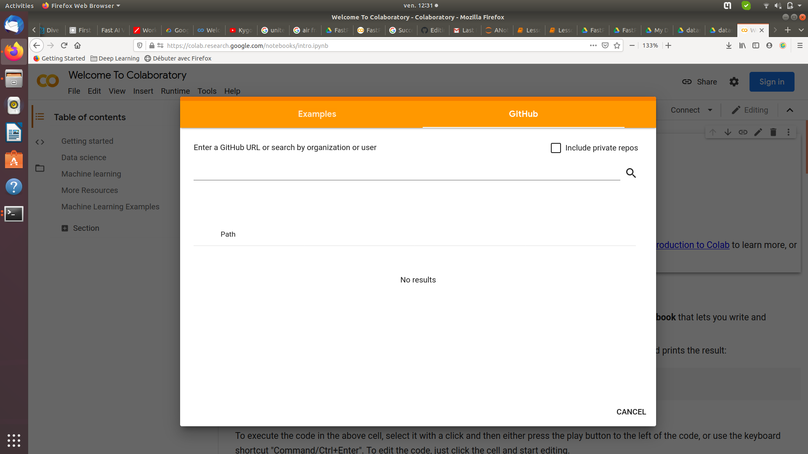
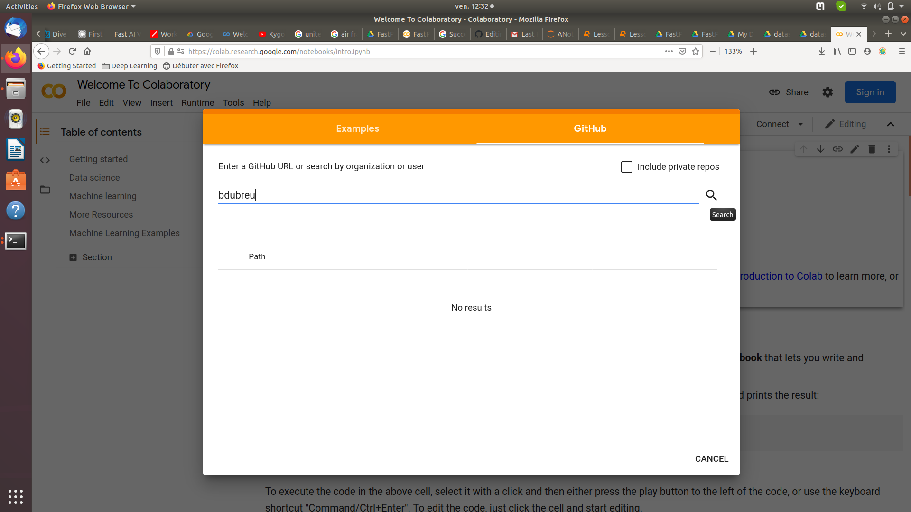

# fastpractice
Exercises for FastAI v2

## Setup
These notebooks are intended for fast and hassle-free pratice. I decided to use Colab to keep the setup minimum. Still, there are a few setps you need to follow.

To start using colab notebooks, go .

You should see a window like this (if not, click on "file -> Open Notebook") :

Please click on the "Github" Tab:

Now, enter "bdubreu" in the search bar and press enter (or click the magnifying glass):

You should see all the notebooks appearing. Select one, open it and you're good to go ;)

## datasets setup - READ THIS TOO !

Some notebooks require external data to run. While you can download this data and put it on Colab yourself, I provided with a simpler solution:

What you can do is create a link towards my folder containing those datasets in Google Drive, and later use this to access the data from your ColabNotebook ;)

Please follow this link: https://drive.google.com/drive/folders/1LtUSiFGWMq7wjGVHOFp_TQVmISqoSVbE
And the right-click on the folder "datasets"
And add a shortcut towards it to your Google Drive:

<b> I strongly suggest you put the link directly into "My Drive"</b>. You can do something else, but then you'll have to navigate your folders inside colab to give the proper path to your Path() variables in python, in the notebook ;)

